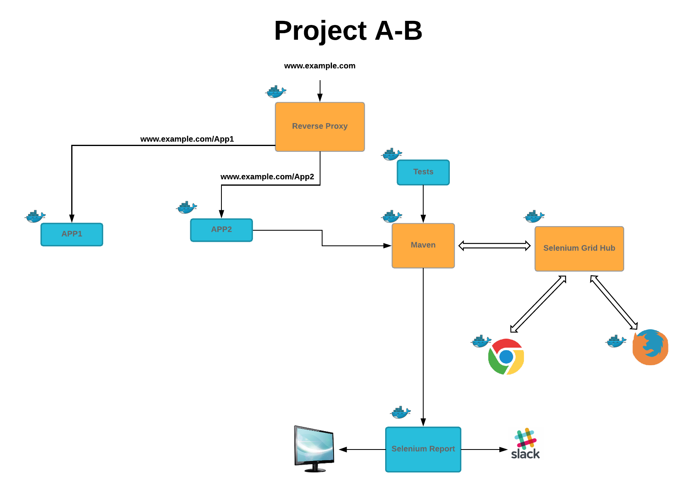

#
# this project to show how docker-compose.yml file could creaet more that one project 

#### NodeJS App 1 
#### NodeJS App 2
#### Nginx as reverse proxy between the 2 Apps 
#### Selenium Grid hub
#### Firefox Node
#### Chrome node
#### Maven container

#### build the reverse proxy docker image  

#``docker build -t reverse-proxy  reverse-proxy``

## will create an images called reverse-proxy
#``docker-compose up -d ``

## Note : Password for VNC is secret

##Please note : if you have a windows node (eg: you want to check using microsoft Edge)

#just downlaod selenium --> selenium-server-standalone-2.47.1.jar  "use any version "
 and then connect this node to the selenium gridhub 

#``java -jar selenium-server-standalone-2.47.1.jar -role node -hub http://<Selenium-Grid-IP>:4444/grid/register``

